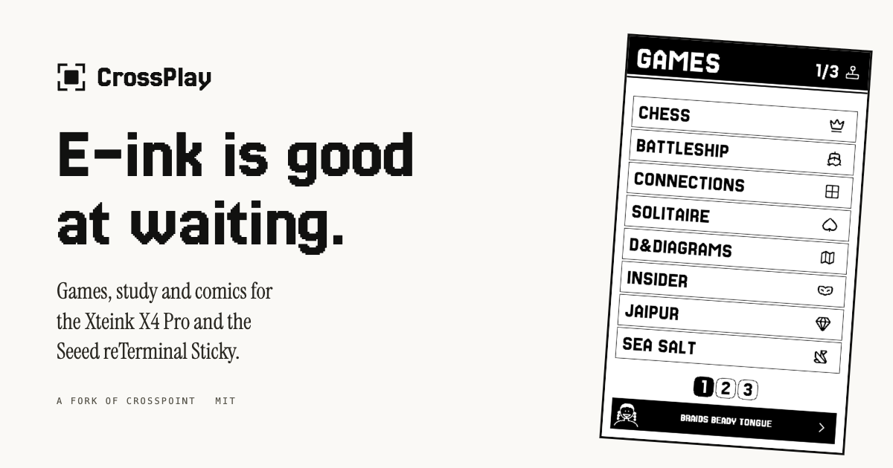

<h1 align="center">
  <br>
  Crossplay
</h1>

<p align="center">
  <strong>E-ink is good at waiting.</strong><br>
  So is a chess position, a flashcard, a puzzle you are halfway through.
</p>

<p align="center">
  <a href="https://github.com/ma-r-s/crossplay/releases">Releases</a> &middot;
  <a href="docs/shelf.md">What is on it</a> &middot;
  <a href="docs/identity.md">Design language</a> &middot;
  <a href="LOCAL_SCOPE.md">Scope</a>
</p>



Crossplay is a fork of [CrossPoint](https://crosspointreader.com/) for the
**Xteink X4 Pro**. CrossPoint turns the device into an excellent e-reader.
Crossplay keeps all of that and adds the other things a screen that holds still
is good at: games you think about rather than react to, spaced-repetition
flashcards, comics, and two devices that play together with nothing to set up.

It is a personal fork, built in the open. Upstream lands on a `base` branch and
is merged in continuously. The reading side is CrossPoint's and stays CrossPoint's:
the EPUB engine, sync and the file browser are theirs, and the reader's chrome is
restyled to match the design language the apps use.

## What is on it

|                 |                                                                    |
| --------------- | ------------------------------------------------------------------ |
| **Chess**       | A full engine on the device, or a board between two of them.       |
| **Battleship**  | Lay out a fleet, then hunt someone else's.                         |
| **Connections** | The daily word grid, with an archive of past boards.               |
| **Solitaire**   | Klondike, turned sideways because that is the shape of a tableau.  |
| **D&Diagrams**  | A nonogram whose clues are a dungeon. 64 of them.                  |
| **Insider**     | A party game for a table and one device.                           |
| **Jaipur**      | The two-player trading game, solo or nearby.                       |
| **Murdle**      | A logic grid built through the solver, so you never have to guess. |
| **Study**       | Anki decks with the FSRS scheduler, offline.                       |
| **Hacker News** | The front page in a reading serif, articles kept on the card.      |
| **xkcd**        | The archive, packed for the card and drawn one to one.             |

Chess, Battleship and Jaipur play over **PLAY NEARBY**: put two devices next to
each other and they find one another. No pairing screen, no room code, no
account, no router, no internet.

## Install it

Crossplay targets the **Xteink X4 Pro** only. For every other supported device,
CrossPoint upstream is the right answer and is excellent.

You do not need to have installed CrossPoint first.

1. Download `crossplay-<version>-x4pro.bin` from the
   [releases page](https://github.com/ma-r-s/crossplay/releases).
2. Plug the device into a computer over USB.
3. Open [crosspointreader.com](https://crosspointreader.com/#flash-tools) in
   Chrome or Edge (the web flasher needs WebSerial, which Firefox and Safari do
   not have), choose **Custom .bin**, and select the file you downloaded.
4. Or from a terminal, if you would rather not trust a web page with your
   serial port:

   ```bash
   esptool.py --chip esp32s3 --baud 921600 write_flash 0x0 crossplay-<version>-x4pro.bin
   ```

Two things worth knowing before you start:

- **`--chip esp32s3`, and only the X4 Pro.** The X4 and X3 are ESP32-C3. This
  binary is not for them and flashing it there is a cross-chip flash. Install
  [CrossPoint](https://crosspointreader.com/) on those instead: it is excellent
  and it is what this is built on.
- **Flashing replaces the firmware, not the SD card.** Your library, your
  reading positions and your fonts are files on that card and are left alone.
  Installing stock CrossPoint over the top puts the device back where it was,
  which makes this cheap to try. If a flash goes wrong,
  [docs/fix-bricked-xteink.md](docs/fix-bricked-xteink.md) is the way back.

## Try it without a device

[**crossplay.ma-r-s.com**](https://crossplay.ma-r-s.com) runs the real firmware
in the browser: the same `src/` and `lib/` the device build compiles, put
through `em++` instead of `g++`, against an SD card of its own. Click the screen
in the hero, or ask for two devices and watch them find each other.

The browser build fakes three things, all documented in
[site/README.md](site/README.md): the network answers from a snapshot, Study's
headword font is the small cut under the big one's name, and sleep is off.

## Build it

```bash
pio run -e x4pro                 # the firmware
pio run -e simulator_x4_pro      # a desktop simulator, SDL2 + a FreeRTOS shim
./scripts_local/check.sh         # host tests and both builds
```

`ui:paperOnTheBand` is a known baseline failure; a tree where it passes is one
whose work fixes it.

The apps live in `src/apps_local/`, which is what keeps the merge with upstream
close to conflict-free. It is not the whole diff: the settings screens, the
reader's menus and parts of `lib/` are reworked too, and those are where a merge
conflict will come from if one does. Read
[LOCAL_SCOPE.md](LOCAL_SCOPE.md) and [docs/shelf.md](docs/shelf.md) before
adding anything, and [docs/building-apps.md](docs/building-apps.md) for how an
app is put together.

## The website

`site/` is static: one HTML file, one stylesheet, two scripts (the emulator's
front end and the avatar word lists), the assets they name, and the browser
build under `site/emulator/`. See [site/README.md](site/README.md) for
how to serve it (a plain `http.server` will not do, the threads need COOP/COEP)
and what has to be true before it deploys.

## Credit and licence

Crossplay is MIT, like the project it forks. It stands on
[CrossPoint](https://github.com/crosspoint-reader/crosspoint-reader) and the
[FreeInk SDK](https://freeink.org/); upstream's own README is kept at
[docs/crosspoint-readme.md](docs/crosspoint-readme.md).

xkcd comics are by Randall Munroe, [CC BY-NC 2.5](https://xkcd.com/license.html),
fetched by the device from [xkcd.com](https://xkcd.com). Connections puzzles are
the New York Times'; Crossplay ships none of them and downloads only what you
ask for. Type is Jersey 25 and Instrument Serif, both SIL OFL.
