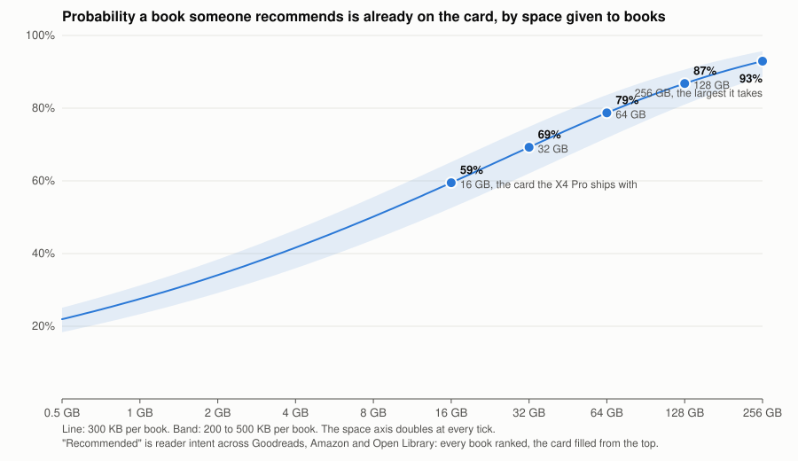

# Library data: every book ranked, and what a card holds of it

Status: measured 2026-09-15, card #517, the data pass for
[`library-plan.md`](library-plan.md). Two universes, kept apart on purpose
because the first report confused them:

1. **Every book.** Open Library's catalog of all works and its reading log,
   the largest open record of people reaching for a book. This is the
   universe the brief is about, and the list generator is run over it.
2. **The pool a site can copy today.** The public-domain books, which is
   what the page can actually write to a card. It carries 1.9% of the
   intent in the first universe. Nothing below calls it "everything".

Reproducible from `tools_local/library/`, about forty minutes, mostly
downloads; the data lives in the workspace's `library-data/`:

```
universe2.py  --goodreads DIR --amazon meta_Books.jsonl.gz --ol DIR --out universe2.md --merged merged.jsonl --pool ranked.jsonl
              # every book: Goodreads (2.2 GB), Amazon (4.9 GB), Open Library (4.7 GB)
catalog.py    --rdf rdf-files.tar.bz2 --out catalog.jsonl              # the pool: Gutenberg's daily RDF, 127 MB
rank.py       --catalog catalog.jsonl --report r.md --list-json ranked.jsonl --ol ol.jsonl --wiki wiki.jsonl
olsignal.py   --catalog catalog.jsonl --pool ranked.jsonl --ol DIR --out ol.jsonl
wikisignal.py --out wiki.jsonl --pool ranked.jsonl
```

## Every book

Three open records of people reaching for a book, joined on title and
author, each turned into a share of its own total, and mixed:

    value = 0.4 x Goodreads ratings (site-wide counters, 2.4 M books, crawled 2017)
          + 0.3 x Amazon review counts (4.4 M books, to 2023)
          + 0.2 x Open Library intent (want to read, reading, read, ratings; 3.3 M works, to 2026)

(Wikipedia page views were tried as a fourth signal at 0.1 and dropped;
see the rough edges below.)

5.0 million merged works. Each source's own top 20 is printed beside the
mixture in the generated report, so the blend can be judged against its
parts: Goodreads' head is The Hunger Games, Harry Potter, Twilight, To
Kill a Mockingbird, Gatsby; Amazon's is Where the Crawdads Sing, The Girl
on the Train, Verity, The Nightingale, The Silent Patient; Open Library's
is Atomic Habits, The 48 Laws of Power, It Ends With Us, Rich Dad Poor
Dad. Three populations, three decades, and the mixture's top ten is Harry
Potter, The Hunger Games, Twilight, To Kill a Mockingbird, The Great
Gatsby, The Fault in Our Stars, Atomic Habits, Pride and Prejudice,
The Hobbit, Divergent.

**How concentrated it is.** Share of all value held by the top N works:

| top 100 | top 1,000 | top 10,000 | top 50,000 | top 200,000 | top 1,000,000 |
| --- | --- | --- | --- | --- | --- |
| 7.5% | 20% | 41% | 60% | 78% | 94% |

Steeper than Open Library's log alone (which put 40% in the top 50,000
and 79% in the first million), because Goodreads and Amazon count every
reader on the site, not one library's patrons. Books stay far
longer-tailed than films: Netflix puts 87% of viewing in its top 3,000.

**What a card holds of it**, filling in rank order at 300 KB a book:

| card | fill to 30% | fill to 95% |
| --- | --- | --- |
| 16 GB (what the X4 Pro ships with) | 16,000 books, 46% of all value | 50,666 books, 60% |
| 32 GB | 32,000 books, 55% | 101,333 books, 69% |
| 64 GB | 64,000 books, 63% | 202,666 books, 78% |
| 128 GB | 128,000 books, 72% | 405,333 books, 86% |
| 256 GB | 256,000 books, 81% | 810,666 books, 92% |



| space for books | 200 KB a book | 300 KB a book | 500 KB a book |
| --- | --- | --- | --- |
| 1 GB | 31% | 28% | 23% |
| 4 GB | 47% | 42% | 36% |
| 16 GB | 65% | 59% | 53% |
| 64 GB | 84% | 79% | 72% |
| 256 GB | 96% | 93% | 89% |

So the dream's closing line, if every book existed, is about 60% on the
card the X4 Pro ships with and about 90% on the largest card it takes.
Aggregate shares, with the plan's caveat: a head inventory covers most of
aggregate demand and almost nobody completely.

**ISBNs.** An ISBN names an edition, so each book's is a choice:
`tools_local/library/isbns.py` takes, per work, the editions Goodreads
lists (ISBN, format, language, readers who rated that edition) and
Amazon's ISBN-10/13, keeps the book's own language, drops audiobooks, and
calls the most-rated edition "best" with the next two as fallbacks. 3.52
million of the 4.98 million works got one (70%); the rest have no edition
with an ISBN in either source. Spot checks: The Hunger Games
9780439023481, Pride and Prejudice 9780679783268, The Hobbit
9780618260300, all the editions Goodreads itself shows for the work.

**Where the pool sits in it.** The public-domain pool a site can copy
today carries 2.9% of all value (1.9% of Open Library's intent alone).
Filling a card with it is filling the card with three percent of what
people reach for; the other 97% is a question of having the books, not of
ranking them.

**Rough edges in this pass**, named: Amazon still lists a few editions
under inverted or publisher-suffixed titles ("GIRL ON THE TRAIN,THE",
"The Girl on the Train (Thorndike Press...)"), so a bestseller can count
twice in Amazon's own total. And Wikipedia page views, joined to every
book by article title, were tried at a tenth of the weight and dropped:
without Wikidata to say which article is the book (its query service
times out on the paged list of literary works), a title join hands "The
File" the article "File", a children's biography called "Dolly Parton"
the singer's traffic, and a book about The Rocky Horror Picture Show the
film's; a cap on plain-title matches removed the worst 19,525 and the
head of the mixture did not move by a single title in either direction,
which is the measure of what the signal was adding. The pool's ranking
keeps its Wikipedia signal because there the join goes through Wikidata's
Gutenberg ids and was checked by hand. The month's per-title counters
are cached in `library-data/wiki/titleviews.json` for a better join
later.

The Open Library-only pass that preceded this one is kept in the
workspace's `library-data/universe.md`.

## The pool a site can copy today

After the filters (text only, public domain, has a text-only EPUB, reads
on the panel, one edition per work) the pool is **63,443 works, 15.4 GB**,
median 205 KB per book. Card sizes as printed, nothing else on the card;
the shares are of the pool's own demand, not of all intent:

| card | fill to 30% | fill to 50% | fill to 75% | fill to 95% |
| --- | --- | --- | --- | --- |
| 16 GB (what the X4 Pro ships with) | 23,856 books, 89% of the pool's demand | 39,255 books, 94% | 54,594 books, 98% | the whole pool |
| 32 GB | 45,786 books, 96% | the whole pool | the whole pool | the whole pool |
| 64 GB and up | the whole pool | the whole pool | the whole pool | the whole pool |

Per language, the pool is 49,300 English works (12.2 GB, 88% of its
demand), then Finnish 3,600, French 3,100, German 2,200, Dutch 950,
Italian 940, Spanish 810, Hungarian 630, Portuguese 600. Every non-English
language fits in under a gigabyte.

### How the pool's list is made

Each work carries a value, its share of demand, and the card is filled in
order of value per byte (the plan's knapsack argument: within one book of
optimal). The value is a mixture of three demand distributions, each taken
as a share of its own total over the pool:

    value = 0.4 x share of Gutenberg downloads (30 days)
          + 0.4 x share of Open Library shelvings (want-to-read, reading, read, ratings)
          + 0.2 x share of Wikipedia page views by humans (a year, eight languages)

Over every book the same generator would use the same shape with the
signals that exist there: shelvings and ratings (Open Library; Goodreads
if its licence allowed), sales rank, library checkouts, page views. The
pool needed downloads because the other two signals only reach its head.

Why each, and why those weights:

- **Downloads** are the only signal that covers every title in every
  language, so they order the tail. Their head is polluted: crawlers put
  "A Pickle for the Knowing Ones" and one volume of Oliver Twist in the
  top 15 on six-figure monthly counts. A work with no other signal keeps
  only its downloads term, which sinks those to rank 150 to 500, where
  they cost 100 KB each and nobody sees them.
- **Shelvings** are the objective itself: someone heard of the book and
  reached for it. 15,036 works in the pool carry them, matched by folded
  title and author surname against the works dump (an Open Library work
  spans every translation, so its count is split across the pool's
  languages in proportion to downloads; before that the Finnish Hamlet sat
  in the top 30). They get the largest weight with downloads.
- **Page views** are "heard of" in the widest sense, and they are what
  lifts the books that happen to be on nobody's Open Library shelf. 2,081
  works carry them: 4,135 Gutenberg ids are linked from Wikidata, and the
  top 8,000 works without a link were looked up by title and author (a hit
  counts only when the article's title is the book's, and a bracketed
  disambiguator must name a written form, or "Wuthering Heights (2026
  film)" stands in for the novel). Views count only for a work with some
  shelvings or 5,000 downloads: Magna Carta, the Rosary and Luther's
  theses have traffic about the subject, not readers of the text, and sat
  above Alice on it. The weight is the smallest because an article is
  about a subject and a shelf is about reading.

A mixture rather than a product: multiplying the three heavy-tailed
signals put 74% of all value in the top 1,000 works, where every demand
curve measured for this project puts 6 to 44%.

### How concentrated the pool's demand is

Share of the pool's value in the top N works, in fill order:

| top 100 | top 1,000 | top 5,000 | top 10,000 | top 20,000 | top 50,000 |
| --- | --- | --- | --- | --- | --- |
| 29% | 62% | 78% | 83% | 88% | 97% |

Steeper than the universe's curve (29% against 6.5% in the top 100)
because the pool's head is the canon everyone has heard of and its tail is
what nobody has.

### What the pool's list looks like

The top 100 is in the second generated report below. The head is Gatsby,
Alice, Romeo and Juliet, Jekyll and Hyde, Wuthering Heights, Pride and
Prejudice, the Odyssey, Hamlet, Frankenstein, Peter Rabbit, the Time
Machine, the Wizard of Oz, Dracula: a bookshop's classics table, with the
two odd seven-figure view counts (Wuthering Heights, the Odyssey)
explained by this year's films. At rank 500, period fiction and translated
drama; at 2,000, Plato's Meno and Martin Chuzzlewit; at 5,000, a Frank
Herbert story and a mushroom-growing manual; at 20,000, sermons and a USDA
canning pamphlet; at 40,000, series fiction for children from the 1910s.
The tail is worth having at 200 KB a book and worth nothing as a list,
which is the case for the device-side search.

### What is still rough

Named so nobody rediscovers it:

- **Duplicates the merge misses.** "A Christmas Carol" and "A Christmas
  Carol in Prose; Being a Ghost Story of Christmas" are both in the top 40,
  one carrying the shelvings and the other the views; "The History of Don
  Quixote, Volume 1" and "Don Quixote" are separate works. The merge keys
  on a folded title cut at the first colon or semicolon, and edition
  dressing before that survives. A pass keyed on author plus a fuzzier
  title, or on Open Library's own work ids, would fold these.
- **Crawler traffic still shapes the middle.** Two Finnish plays by Lauri
  Haarla sit at ranks 502 and 505 on 23,000 monthly downloads each, and
  "The Book of the Thousand Nights and a Night, Volume 1 (of 10)" at 503
  on 130,000. Averaging several monthly catalog snapshots would damp the
  ones that come and go; a work with no shelvings and no article past a
  download threshold could be capped outright.
- **Non-English works rank mostly on downloads.** Open Library and
  Wikipedia are English-heavy, so the per-language ordering inside French,
  German or Spanish is closer to v0 than the English one. Per-language
  Wikipedia views exist and are fetched; per-language shelvings do not.
- **Only 2,081 works carry page views.** The title search covered the top
  8,000 by value; extending it to the whole pool costs an hour of API time
  and would mostly find nothing, which is itself the signal.
- **"Share of demand" is share of this model's value over the pool.** It
  says nothing about books outside the pool; the universe section does.

## The generated reports

What follows is `universe2.py`'s output, then `rank.py`'s, verbatim.

# Every book, ranked on Goodreads, Amazon and Open Library together

4,982,941 merged works. Sources and totals: Goodreads ratings 972,631,852 over 2.4 M books (site-wide counters, crawled 2017); Amazon review counts 696,642,123 over 4.4 M books (to 2023); Open Library intent 11,919,695 events (to 2026). Weights: gr 0.44, az 0.33, ol 0.22.

**The public-domain pool a site can copy today carries 2.9% of this value.**

## Each source's own top 20

So the mixture can be judged against its parts.

| # | Goodreads ratings | Amazon reviews | Open Library intent |
| --- | --- | --- | --- |
| 1 | The Hunger Games (5,066,596) | Where the Crawdads Sing (616,040) | Atomic Habits : Lets Change Your Atomi (64,004) |
| 2 | Harry Potter and the Sorcerer's Stone (4,972,886) | The Girl on the Train (492,222) | The 48 Laws of Power (52,365) |
| 3 | Twilight (Twilight, #1) (4,052,303) | The Girl On The Train (Thorndike Press (492,077) | It Ends with Us (45,430) |
| 4 | To Kill a Mockingbird (3,402,363) | The Girl on the Train (491,970) | Rich Dad, Poor Dad (37,916) |
| 5 | The Great Gatsby (2,852,829) | GIRL ON THE TRAIN,THE (491,874) | The Subtle Art of Not Giving a F*ck (35,316) |
| 6 | The Fault in Our Stars (2,564,656) | Verity (304,071) | Control Your Mind and Master Your Feel (25,787) |
| 7 | Divergent (2,277,881) | It Ends with Us (295,980) | Um casamento arranjado (24,801) |
| 8 | Pride and Prejudice (2,239,983) | The Nightingale (288,444) | Harry Potter and the Philosopher's Sto (24,754) |
| 9 | The Hobbit (2,228,898) | The Silent Patient (271,262) | It Starts with Us (19,924) |
| 10 | The Catcher in the Rye (2,166,748) | Silent Patient (269,517) | Think and Grow Rich (18,739) |
| 11 | Angels & Demons (2,126,047) | The Silent Patient (Thorndike Press (267,580) | The Psychology of Money (15,291) |
| 12 | 1984 (2,125,928) | The Silent Patient The Richard and Jud (259,482) | Twisted Love (15,018) |
| 13 | The Diary of a Young Girl (2,082,057) | Reminders of Him (Center Point (242,240) | How to Win Friends and Influence Peopl (14,415) |
| 14 | Animal Farm (2,035,585) | Reminders of Him (236,673) | A Game of Thrones (14,214) |
| 15 | Harry Potter and the Prisoner of Azkab (2,019,176) | The Midnight Library (235,586) | It (12,469) |
| 16 | Catching Fire (2,015,024) | The Midnight Library (Wheeler Publishi (233,970) | Haunting Adeline (12,382) |
| 17 | The Girl with the Dragon Tattoo (Mille (1,982,596) | BEST SELLER NO.1 AUTHOR The Midnight L (232,620) | Diary of a Wimpy Kid (11,327) |
| 18 | Harry Potter and the Chamber of Secret (1,955,192) | Bestseller_the midnight library matt h (227,625) | I Don't Love You Anymore (11,320) |
| 19 | The Kite Runner (1,924,586) | Eleanor Oliphant is Completely Fine (227,221) | Power of Your Subconscious Mind (10,558) |
| 20 | Harry Potter and the Goblet of Fire (1,912,948) | Eleanor Oliphant is Completely Fine (T (225,854) | Latidos que no dije (10,324) |

## How concentrated it is

| top N works | share of all value | 
| --- | --- |
| 100 | 7.5% |
| 1,000 | 20.0% |
| 10,000 | 40.7% |
| 50,000 | 60.3% |
| 100,000 | 69.3% |
| 200,000 | 77.9% |
| 500,000 | 87.7% |
| 1,000,000 | 93.5% |

## What fits, at 300 KB per book

| card | fill to 30% | fill to 95% |
| --- | --- | --- |
| 16 GB | 16,000 books, 46% | 50,666 books, 60% |
| 32 GB | 32,000 books, 55% | 101,333 books, 69% |
| 64 GB | 64,000 books, 63% | 202,666 books, 78% |
| 128 GB | 128,000 books, 72% | 405,333 books, 86% |
| 256 GB | 256,000 books, 81% | 810,666 books, 92% |

## The top 100

| # | title | author | year | Goodreads ratings | Amazon reviews | OL intent |
| --- | --- | --- | --- | --- | --- | --- |
| 1 | The Hunger Games | Suzanne Collins | 2008 | 5,066,596 | 81,557 | 7,898 |
| 2 | Harry Potter and the Sorcerer's Stone | J.K. Rowling | 1997 | 4,972,886 | 25,692 | 5 |
| 3 | Twilight (Twilight, #1) | Stephenie Meyer | 2005 | 4,052,303 | 35,518 | 6,875 |
| 4 | To Kill a Mockingbird | Harper Lee | 1960 | 3,402,363 | 132,041 | 6,604 |
| 5 | The Great Gatsby | F. Scott Fitzgerald | 1925 | 2,852,829 | 17,069 | 3,751 |
| 6 | The Fault in Our Stars | John Green | 2012 | 2,564,656 | 160,059 | 4,728 |
| 7 | Atomic Habits : Lets Change Your Atomic Habits! | James Clear |  | 0 | 109,230 | 64,004 |
| 8 | Pride and Prejudice | Jane Austen | 1813 | 2,239,983 | 45,465 | 8,431 |
| 9 | The Hobbit | J.R.R. Tolkien | 1937 | 2,228,898 | 66,644 | 5,606 |
| 10 | Divergent | Veronica Roth | 2011 | 2,277,881 | 57,633 | 2,378 |
| 11 | Harry Potter and the Prisoner of Azkaban | J.K. Rowling | 1999 | 2,019,176 | 83,126 | 6,323 |
| 12 | The Catcher in the Rye | J.D. Salinger | 1951 | 2,166,748 | 38,584 | 3,438 |
| 13 | Animal Farm | George Orwell | 1945 | 2,035,585 | 67,685 | 5,823 |
| 14 | Harry Potter and the Chamber of Secrets | J.K. Rowling | 1998 | 1,955,192 | 88,889 | 7,144 |
| 15 | It Ends with Us | Colleen Hoover | 2016 | 104,937 | 295,980 | 45,430 |
| 16 | 1984 | George Orwell | 1949 | 2,125,928 | 111,713 | 119 |
| 17 | Harry Potter and the Deathly Hallows | J.K. Rowling | 2007 | 1,889,600 | 88,904 | 6,410 |
| 18 | Angels & Demons | Dan Brown | 2000 | 2,126,047 | 20,888 | 2,132 |
| 19 | Harry Potter and the Goblet of Fire | J.K. Rowling | 2000 | 1,912,948 | 77,345 | 5,267 |
| 20 | The 48 Laws of Power | Robert Greene |  | 0 | 66,990 | 52,365 |
| 21 | Harry Potter and the Order of the Phoenix [2/2] | J.K. Rowling | 2003 | 1,892,452 | 78,308 | 4,967 |
| 22 | A Game of Thrones | George R.R. Martin | 1996 | 1,496,066 | 73,279 | 14,214 |
| 23 | The Diary of a Young Girl | Anne Frank | 1947 | 2,082,057 | 43,281 | 51 |
| 24 | The Kite Runner | Khaled Hosseini | 2003 | 1,924,586 | 51,246 | 3,093 |
| 25 | Catching Fire | Suzanne Collins | 2009 | 2,015,024 | 65,272 | 6 |
| 26 | Harry Potter and the Half-Blood Prince | J.K. Rowling | 2005 | 1,824,878 | 73,587 | 3,981 |
| 27 | Mockingjay | Suzanne Collins | 2010 | 1,897,651 | 80,464 | 1,779 |
| 28 | The Fellowship of the Ring | J.R.R. Tolkien | 1954 | 1,880,521 | 21,299 | 2,875 |
| 29 | The Girl with the Dragon Tattoo (Millennium, #1) | Stieg Larsson | 2005 | 1,982,596 | 31,623 | 0 |
| 30 | Lord of the Flies | William Golding | 1954 | 1,707,618 | 46,614 | 3,691 |
| 31 | Gone Girl | Gillian Flynn | 2012 | 1,667,157 | 161,723 | 1,616 |
| 32 | Fifty Shades of Grey | E.L. James | 2011 | 1,448,482 | 111,806 | 7,305 |
| 33 | The Girl on the Train | Paula Hawkins | 2015 | 1,301,700 | 492,222 | 1,006 |
| 34 | Romeo and Juliet | William Shakespeare | 1597 | 1,702,565 | 8,487 | 3,510 |
| 35 | Rich Dad, Poor Dad | Robert T. Kiyosaki | 1997 | 186,289 | 91,924 | 37,916 |
| 36 | The Lightning Thief | Rick Riordan | 2005 | 1,472,245 | 49,371 | 7,433 |
| 37 | The Da Vinci Code | Dan Brown | 2003 | 1,578,627 | 19,291 | 3,742 |
| 38 | The Lovely Bones | Alice Sebold | 2002 | 1,685,957 | 13,415 | 829 |
| 39 | Lion, the Witch, and the Wardrobe | C.S. Lewis | 1950 | 1,629,782 | 18,777 | 2,035 |
| 40 | The Help | Kathryn Stockett | 2009 | 1,638,864 | 33,082 | 1,233 |
| 41 | Of Mice and Men | John Steinbeck | 1937 | 1,548,931 | 38,982 | 2,646 |
| 42 | The Subtle Art of Not Giving a F*ck | Mark  Manson | 2016 | 70,642 | 139,452 | 35,316 |
| 43 | The Alchemist | Paulo Coelho | 1988 | 1,457,088 | 142,965 | 2 |
| 44 | The Giver | Lois Lowry | 1993 | 1,361,154 | 39,454 | 3,342 |
| 45 | The Book Thief | Markus Zusak | 2005 | 1,326,169 | 67,648 | 3,053 |
| 46 | Little Women | Louisa May Alcott | 1868 | 1,336,336 | 20,620 | 3,121 |
| 47 | Memoirs of a Geisha | Arthur Golden | 1997 | 1,439,510 | 16,759 | 578 |
| 48 | Fahrenheit 451 | Ray Bradbury | 1953 | 1,204,152 | 50,028 | 4,913 |
| 49 | Jane Eyre | Charlotte Bronte | 1847 | 1,298,373 | 24,132 | 2,074 |
| 50 | The Time Traveler's Wife | Audrey Niffenegger | 2003 | 1,329,358 | 10,945 | 670 |
| 51 | City of Bones | Cassandra Clare | 2007 | 1,276,443 | 23,695 | 1,306 |
| 52 | Charlotte's Web | E.B. White | 1952 | 1,117,276 | 28,277 | 4,776 |
| 53 | Brave New World | Aldous Huxley | 1932 | 1,103,420 | 42,797 | 3,953 |
| 54 | New Moon | Stephenie Meyer | 2006 | 1,217,539 | 21,148 | 1,311 |
| 55 | Eat, Pray, Love | Elizabeth Gilbert | 2006 | 1,226,472 | 15,284 | 538 |
| 56 | Eclipse | Stephenie Meyer | 2007 | 1,189,270 | 20,479 | 1,196 |
| 57 | Eragon | Christopher Paolini | 2002 | 1,150,741 | 14,252 | 1,790 |
| 58 | Wuthering Heights | Emily Bronte | 1847 | 1,022,330 | 26,554 | 3,914 |
| 59 | The Hitchhiker's Guide to the Galaxy | Douglas Adams | 1979 | 1,065,802 | 24,130 | 2,736 |
| 60 | Breaking Dawn | Stephenie Meyer | 2008 | 1,116,839 | 25,490 | 1,119 |
| 61 | Life of Pi | Yann Martel | 2001 | 1,087,878 | 21,102 | 1,289 |
| 62 | Water for Elephants | Sara Gruen | 2006 | 1,124,517 | 11,740 | 276 |
| 63 | The Perks of Being a Wallflower | Stephen Chbosky | 1999 | 974,361 | 38,378 | 3,005 |
| 64 | The Notebook | Nicholas Sparks | 1996 | 1,088,680 | 11,699 | 875 |
| 65 | Adventures of Huckleberry Finn | Mark Twain | 1884 | 1,018,244 | 15,140 | 1,821 |
| 66 | It | Stephen King | 1986 | 515,463 | 47,076 | 12,469 |
| 67 | Where the Sidewalk Ends | Shel Silverstein | 1974 | 1,036,312 | 11,428 | 551 |
| 68 | Insurgent | Veronica Roth | 2012 | 961,923 | 60,303 | 907 |
| 69 | The Shining | Stephen King | 1977 | 845,784 | 42,724 | 3,992 |
| 70 | Frankenstein | Mary Wollstonecraft Shelley | 1818 | 904,994 | 22,989 | 3,024 |
| 71 | Control Your Mind and Master Your Feelings | Eric Robertson |  | 0 | 0 | 25,787 |
| 72 | The Curious Incident of the Dog in the Night-Time | Mark Haddon | 2003 | 928,719 | 33,418 | 2,027 |
| 73 | A Thousand Splendid Suns | Khaled Hosseini | 2007 | 884,890 | 46,487 | 2,677 |
| 74 | Handmaid's Tale | Margaret Atwood | 1985 | 737,910 | 155,561 | 3,431 |
| 75 | Harry Potter and the Philosopher's Stone | J.K. Rowling |  | 0 | 25,473 | 24,754 |
| 76 | The Golden Compass (His Dark Materials, 1) | Philip Pullman | 1995 | 1,016,116 | 10,533 | 0 |
| 77 | How to Win Friends and Influence People | Dale Carnegie | 1936 | 321,072 | 112,233 | 14,415 |
| 78 | Ender's Game [1/2] | Orson Scott Card | 1985 | 890,890 | 40,160 | 2,218 |
| 79 | Um casamento arranjado | Zana Kheiron |  | 0 | 0 | 24,801 |
| 80 | The Secret Life of Bees | Sue Monk Kidd | 2001 | 950,440 | 32,040 | 550 |
| 81 | Think and Grow Rich | Napoleon Hill | 1937 | 122,396 | 98,293 | 18,739 |
| 82 | Gone with the Wind | Margaret Mitchell | 1936 | 913,780 | 17,247 | 919 |
| 83 | Looking for Alaska | John Green | 2005 | 853,773 | 31,881 | 1,905 |
| 84 | Maze Runner | James Dashner | 2009 | 805,362 | 42,496 | 2,684 |
| 85 | It Starts with Us | Colleen Hoover |  | 0 | 139,815 | 19,924 |
| 86 | My Sister's Keeper | Jodi Picoult | 2004 | 900,732 | 8,316 | 473 |
| 87 | Holes | Louis Sachar | 1998 | 784,203 | 31,110 | 2,483 |
| 88 | Slaughterhouse-Five | Kurt Vonnegut Jr. | 1969 | 909,128 | 0 | 0 |
| 89 | Little Prince | Antoine de Saint-Exupery | 1943 | 888,952 | 14,387 | 47 |
| 90 | All the Light We Cannot See | Anthony Doerr | 2014 | 580,709 | 216,285 | 1,511 |
| 91 | Dracula | Bram Stoker | 1897 | 711,183 | 24,641 | 3,031 |
| 92 | Me Before You | Jojo Moyes | 2012 | 767,013 | 6,535 | 2,027 |
| 93 | Sense and Sensibility | Jane Austen | 1811 | 786,130 | 11,317 | 1,252 |
| 94 | Dune | Frank Herbert | 1965 | 538,013 | 89,851 | 4,957 |
| 95 | The Outsiders | S.E. Hinton | 2013 | 698,475 | 36,834 | 2,376 |
| 96 | Picture of Dorian Gray | Oscar Wilde | 1890 | 694,769 | 23,780 | 2,412 |
| 97 | The Host | Stephenie Meyer | 2008 | 784,707 | 13,332 | 303 |
| 98 | Diary of a Wimpy Kid | Jeff Kinney | 2004 | 298,120 | 47,403 | 11,327 |
| 99 | Secret Garden | Frances Hodgson Burnett | 1911 | 707,050 | 20,988 | 1,673 |
| 100 | The Martian | Andy Weir | 2012 | 545,278 | 171,358 | 1,738 |


# Library data: what is in the catalog, what fits, what the list looks like

Produced by `tools_local/library/rank.py` from Project Gutenberg's catalog (`catalog.py`), v0: value = Gutenberg's 30-day download count, weight = the text-only EPUB's size. Every count below carries its share of demand (downloads), because a filter that removes 10% of titles and 0.1% of demand costs nothing.

## Census

Records: 79,395. Demand mass (30-day downloads): 76,612,080.

### By type

| | titles | share of demand |
| --- | --- | --- |
| Text | 78,144 | 98.2% |
| Sound | 1,114 | 1.7% |
| Dataset | 89 | 0.0% |
| Image | 33 | 0.0% |
| MovingImage | 8 | 0.0% |
| Collection | 4 | 0.0% |
| StillImage | 3 | 0.0% |

### By rights

| | titles | share of demand |
| --- | --- | --- |
| Public domain in the USA. | 78,532 | 99.0% |
| Copyrighted. Read the copyright notice i | 863 | 1.0% |

### By language (first)

| | titles | share of demand |
| --- | --- | --- |
| en | 63,018 | 88.2% |
| fr | 4,205 | 3.5% |
| fi | 3,686 | 1.9% |
| de | 2,463 | 2.2% |
| it | 1,110 | 0.7% |
| nl | 1,109 | 0.7% |
| es | 898 | 0.9% |
| hu | 654 | 0.2% |
| pt | 647 | 0.3% |
| zh | 436 | 0.5% |
| sv | 253 | 0.1% |
| el | 216 | 0.1% |
| eo | 124 | 0.1% |
| la | 108 | 0.1% |
| ca | 95 | 0.1% |

### By LC class (first letter of the first code)

A: general works, B: philosophy/religion, D-F: history, G: geography/recreation, H: social sciences, J: politics, K: law, L: education, M: music, N: arts, P: literature, Q: science, R: medicine, S: agriculture, T: technology, U/V: military, Z: bibliography.

| | titles | share of demand |
| --- | --- | --- |
| P | 45,012 | 64.8% |
| D | 8,136 | 8.2% |
| B | 4,855 | 5.9% |
| A | 3,239 | 2.3% |
| Q | 2,842 | 2.6% |
| E | 2,396 | 2.5% |
| H | 1,984 | 2.3% |
| F | 1,900 | 2.0% |
| T | 1,639 | 1.4% |
| G | 1,476 | 1.7% |
| N | 1,206 | 1.1% |
| S | 798 | 0.7% |
| R | 686 | 0.5% |
| M | 665 | 0.6% |
| Z | 590 | 0.6% |
| C | 456 | 0.8% |
| J | 411 | 0.7% |
| L | 375 | 0.3% |
| U | 281 | 0.4% |
| K | 252 | 0.2% |
| V | 113 | 0.1% |
| none | 83 | 0.0% |

## Filters, in order, each counted

| step | removed | demand removed | remaining | demand remaining |
| --- | --- | --- | --- | --- |
| Text only | 1,251 | 1.77% | 78,144 | 98.2% |
| Public domain only | 427 | 0.62% | 77,717 | 97.6% |
| Has a text-only EPUB | 196 | 0.07% | 77,521 | 97.5% |
| Form (reads on the panel) | 7,601 | 7.06% | 69,920 | 90.5% |
| One edition per work | 6,477 | 6.38% | 63,443 | 90.5% |

The work merge folded 6,477 editions into their most downloaded one; the survivor carries the sum of their demand, so the step removes titles, not demand.

### What each form rule removed

| rule | titles | share of demand |
| --- | --- | --- |
| locc:AP | 2,759 | 1.68% |
| subject | 1,944 | 2.28% |
| locc:Z | 597 | 0.66% |
| locc:ML | 395 | 0.48% |
| title | 389 | 0.49% |
| locc:ND | 327 | 0.33% |
| locc:NA | 266 | 0.23% |
| locc:N | 241 | 0.24% |
| locc:NC | 204 | 0.15% |
| locc:NK | 168 | 0.16% |
| locc:QA | 91 | 0.13% |
| locc:MT | 79 | 0.09% |
| locc:NE | 52 | 0.07% |
| locc:M | 45 | 0.04% |
| locc:NB | 38 | 0.03% |
| locc:NX | 6 | 0.01% |

## The value each work carries

v1: value = 0.4 x share of downloads + 0.4 x share of Open Library shelvings + 0.2 x share of Wikipedia page views, each share taken over the pool (69,311,106 downloads in 30 days, 266,230 shelvings, 154,096,544 views in a year). Matched: 15,036 works carry shelvings and 1,898 carry views; of the 1,000 most downloaded, 533 have shelvings and 259 have an article. A work with neither keeps only its downloads term, which is what demotes crawler-inflated titles; views count only for a work with some shelvings or at least 5,000 downloads, so a subject looked up but not read (Magna Carta) does not ride its article.

## The pool after the filters

63,443 works, 15.4 GB as text-only EPUBs (median 206 KB), Coverage below is the share of the pool's value (defined above).

### Per language

| language | works | GB | share of pool demand |
| --- | --- | --- | --- |
| en | 49,398 | 12.25 | 90.2% |
| fi | 3,639 | 0.68 | 1.0% |
| fr | 3,166 | 0.79 | 3.9% |
| de | 2,174 | 0.54 | 2.4% |
| nl | 953 | 0.23 | 0.3% |
| it | 939 | 0.24 | 0.5% |
| es | 814 | 0.22 | 0.5% |
| hu | 631 | 0.16 | 0.1% |
| pt | 599 | 0.10 | 0.2% |
| sv | 243 | 0.05 | 0.1% |
| zh | 169 | 0.05 | 0.3% |
| eo | 102 | 0.01 | 0.0% |

## How concentrated demand is

Share of the pool's value held by the top N works, in the order the card is filled (value per byte) and in raw value order.

| top N | by value per byte | by popularity |
| --- | --- | --- |
| 100 | 29.1% | 31.7% |
| 500 | 51.5% | 54.0% |
| 1,000 | 61.5% | 63.4% |
| 2,000 | 70.8% | 72.2% |
| 5,000 | 77.9% | 79.3% |
| 10,000 | 82.5% | 84.3% |
| 20,000 | 87.6% | 89.9% |
| 30,000 | 91.2% | 93.4% |
| 40,000 | 94.3% | 95.9% |
| 50,000 | 97.0% | 98.0% |

## What fits

Card sizes as printed (decimal gigabytes); the budget is the slider's share of the card, with nothing else on it. A real card loses a few percent to the file system and to whatever is already there. 'The whole pool' means every book in this pool fits with room over; the pool is not every book, see universe.py for that.

| card | fill to 30% | fill to 50% | fill to 75% | fill to 95% |
| --- | --- | --- | --- | --- |
| 16 GB | 23,856 books, 4.8 GB, 89.0% of demand | 39,255 books, 8.0 GB, 94.1% of demand | 54,594 books, 12.0 GB, 98.1% of demand | 63,232 books, 15.2 GB, 100.0% of demand |
| 32 GB | 45,786 books, 9.6 GB, 95.9% of demand | the whole pool (63,443 books, 15.4 GB) | the whole pool (63,443 books, 15.4 GB) | the whole pool (63,443 books, 15.4 GB) |
| 64 GB | the whole pool (63,443 books, 15.4 GB) | the whole pool (63,443 books, 15.4 GB) | the whole pool (63,443 books, 15.4 GB) | the whole pool (63,443 books, 15.4 GB) |
| 128 GB | the whole pool (63,443 books, 15.4 GB) | the whole pool (63,443 books, 15.4 GB) | the whole pool (63,443 books, 15.4 GB) | the whole pool (63,443 books, 15.4 GB) |
| 256 GB | the whole pool (63,443 books, 15.4 GB) | the whole pool (63,443 books, 15.4 GB) | the whole pool (63,443 books, 15.4 GB) | the whole pool (63,443 books, 15.4 GB) |

## The top 100, in fill order

| # | title | author | lang | downloads/30d | OL shelvings | Wikipedia views/yr | KB |
| --- | --- | --- | --- | --- | --- | --- | --- |
| 1 | The Great Gatsby | Fitzgerald, F. Scott (Francis Scott) | en | 53,454 | 3,759 | 1,821,662 | 181 |
| 2 | Alice's Adventures in Wonderland | Carroll, Lewis | en | 115,042 | 2,570 | 900,439 | 136 |
| 3 | Romeo and Juliet | Shakespeare, William | en | 192,777 | 3,489 | 1,087,926 | 199 |
| 4 | The strange case of Dr. Jekyll and Mr. Hyde | Stevenson, Robert Louis | en | 179,223 | 1,856 | 1,212,612 | 142 |
| 5 | Wuthering Heights | Brontë, Emily | en | 47,901 | 3,907 | 7,266,598 | 435 |
| 6 | Pride and Prejudice | Austen, Jane | en | 287,776 | 8,409 | 2,271,081 | 558 |
| 7 | The Odyssey | Homer | en | 130,423 | 1 | 8,364,901 | 381 |
| 8 | As a man thinketh | Allen, James | en | 12,094 | 1,607 | 59,122 | 91 |
| 9 | Hamlet | Shakespeare, William | en | 31,312 | 2,101 | 1,755,557 | 209 |
| 10 | Frankenstein; or, the modern prometheus | Shelley, Mary Wollstonecraft | en | 97,676 | 2,974 | 3,234,257 | 356 |
| 11 | The Tale of Peter Rabbit | Potter, Beatrix | en | 28,142 | 915 | 157,403 | 71 |
| 12 | The Time Machine | Wells, H. G. (Herbert George) | en | 17,297 | 2,066 | 371,175 | 162 |
| 13 | The Wonderful Wizard of Oz | Baum, L. Frank (Lyman Frank) | en | 79,778 | 1,690 | 843,771 | 181 |
| 14 | The Yellow Wallpaper | Gilman, Charlotte Perkins | en | 24,156 | 850 | 342,979 | 87 |
| 15 | The Raven | Poe, Edgar Allan | en | 5,706 | 619 | 445,275 | 72 |
| 16 | The Prince | Machiavelli, Niccolò | en | 34,211 | 2,255 | 709,267 | 217 |
| 17 | Heart of Darkness | Conrad, Joseph | en | 16,455 | 1,435 | 684,610 | 163 |
| 18 | A Christmas Carol | Dickens, Charles | en | 6,992 | 1,156 | 904,494 | 153 |
| 19 | Macbeth | Shakespeare, William | en | 12,059 | 1,471 | 897,467 | 183 |
| 20 | Dracula | Stoker, Bram | en | 201,834 | 3,028 | 1,699,110 | 433 |
| 21 | The Invisible Man: A Grotesque Romance | Wells, H. G. (Herbert George) | en | 6,943 | 2,221 | 203,298 | 215 |
| 22 | Siddhartha | Hesse, Hermann | en | 8,859 | 1,198 | 720,767 | 165 |
| 23 | A Midsummer Night's Dream | Shakespeare, William | en | 47,383 | 1,131 | 731,434 | 188 |
| 24 | The Importance of Being Earnest: A Trivial Comedy for Serious People | Wilde, Oscar | en | 22,795 | 537 | 477,934 | 104 |
| 25 | The Legend of Sleepy Hollow | Irving, Washington | en | 37,791 | 404 | 375,965 | 88 |
| 26 | The call of the wild | London, Jack | en | 29,853 | 1,105 | 365,318 | 156 |
| 27 | The war of the worlds | Wells, H. G. (Herbert George) | en | 13,735 | 1,634 | 526,331 | 242 |
| 28 | The book of Enoch | ? | en | 8,173 | 19 | 1,815,141 | 187 |
| 29 | Carmilla | Le Fanu, Joseph Sheridan | en | 13,007 | 822 | 438,002 | 150 |
| 30 | The call of Cthulhu | Lovecraft, H. P. (Howard Phillips) | en | 70,233 | 259 | 360,868 | 101 |
| 31 | Treasure Island | Stevenson, Robert Louis | en | 32,940 | 1,409 | 805,184 | 273 |
| 32 | The Cask of Amontillado | Poe, Edgar Allan | en | 62,184 | 100 | 261,805 | 71 |
| 33 | The Secret Garden | Burnett, Frances Hodgson | en | 49,058 | 1,674 | 316,809 | 271 |
| 34 | Through the Looking-Glass | Carroll, Lewis | en | 13,106 | 702 | 429,602 | 143 |
| 35 | The Prophet | Gibran, Kahlil | en | 13,967 | 667 | 206,183 | 116 |
| 36 | Winnie-the-Pooh | Milne, A. A. (Alan Alexander) | en | 13,378 | 833 | 47,287 | 123 |
| 37 | A Study in Scarlet | Doyle, Arthur Conan | en | 65,902 | 939 | 305,380 | 194 |
| 38 | Little Women; Or, Meg, Jo, Beth, and Amy | Alcott, Louisa May | en | 102,542 | 3,128 | 756,762 | 558 |
| 39 | A Christmas Carol in Prose; Being a Ghost Story of Christmas | Dickens, Charles | en | 18,624 | 0 | 1,196,287 | 148 |
| 40 | The Picture of Dorian Gray | Wilde, Oscar | en | 45,508 | 2,414 | 913,173 | 460 |
| 41 | The Hound of the Baskervilles | Doyle, Arthur Conan | en | 137,175 | 840 | 305,580 | 228 |
| 42 | Adventures of Huckleberry Finn | Twain, Mark | en | 40,966 | 1,837 | 546,723 | 347 |
| 43 | The Fall of the House of Usher | Poe, Edgar Allan | en | 4,979 | 273 | 386,884 | 88 |
| 44 | Candide | Voltaire | en | 10,887 | 691 | 473,749 | 161 |
| 45 | A Visit From Saint Nicholas | Moore, Clement Clarke | en | 670 | 419 | 0 | 59 |
| 46 | The Adventures of Tom Sawyer, Complete | Twain, Mark | en | 49,064 | 1,351 | 547,014 | 288 |
| 47 | Anne of Green Gables | Montgomery, L. M. (Lucy Maud) | en | 27,505 | 1,622 | 667,555 | 330 |
| 48 | The King in Yellow | Chambers, Robert W. (Robert William) | en | 93,459 | 442 | 1,280,524 | 286 |
| 49 | The Mysterious Affair at Styles | Christie, Agatha | en | 66,730 | 1,013 | 225,604 | 223 |
| 50 | The History of a Lie: "The Protocols of the Wise Men of Zion" | Bernstein, Herman | en | 822 | 3 | 1,130,731 | 154 |
| 51 | The Jungle Book | Kipling, Rudyard | en | 29,141 | 582 | 524,390 | 182 |
| 52 | The Tempest | Shakespeare, William | en | 9,441 | 772 | 489,956 | 206 |
| 53 | Jane Eyre: An Autobiography | Brontë, Charlotte | en | 95,505 | 2,064 | 1,376,491 | 607 |
| 54 | The Turn of the Screw | James, Henry | en | 68,373 | 462 | 398,500 | 183 |
| 55 | The Waste Land | Eliot, T. S. (Thomas Stearns) | en | 2,710 | 156 | 353,549 | 82 |
| 56 | Othello | Shakespeare, William | en | 6,254 | 556 | 655,756 | 202 |
| 57 | The Communist Manifesto | Marx, Karl, Engels, Friedrich | en | 10,659 | 11 | 632,912 | 106 |
| 58 | A farewell to arms | Hemingway, Ernest | en | 75,011 | 678 | 265,691 | 214 |
| 59 | Moby Dick; Or, The Whale | Melville, Herman | en | 193,299 | 2,451 | 978,037 | 726 |
| 60 | The Rime of the Ancient Mariner | Coleridge, Samuel Taylor | en | 2,731 | 98 | 391,199 | 81 |
| 61 | A Tale of Two Cities | Dickens, Charles | en | 38,643 | 1,819 | 760,302 | 487 |
| 62 | The Great God Pan | Machen, Arthur | en | 60,590 | 329 | 111,517 | 125 |
| 63 | Sense and Sensibility | Austen, Jane | en | 109,932 | 1,247 | 606,030 | 421 |
| 64 | The Seven Dials mystery | Christie, Agatha | en | 63,965 | 163 | 1,139,613 | 271 |
| 65 | Paradise Lost | Milton, John | en | 43,949 | 928 | 1,029,505 | 397 |
| 66 | The Merchant of Venice | Shakespeare, William | en | 6,381 | 610 | 367,963 | 193 |
| 67 | The Dunwich horror | Lovecraft, H. P. (Howard Phillips) | en | 69,569 | 158 | 147,468 | 113 |
| 68 | Jenseits von Gut und Böse | Nietzsche, Friedrich Wilhelm | de | 1,977 | 942 | 223,043 | 235 |
| 69 | The Wind in the Willows | Grahame, Kenneth | en | 13,528 | 827 | 341,752 | 242 |
| 70 | Pygmalion | Shaw, Bernard | en | 8,147 | 371 | 373,129 | 155 |
| 71 | The murder of Roger Ackroyd | Christie, Agatha | en | 70,611 | 1,138 | 226,301 | 345 |
| 72 | Julius Caesar | Shakespeare, William | en | 7,134 | 603 | 257,134 | 185 |
| 73 | Anthem | Rand, Ayn | en | 7,614 | 412 | 76,274 | 111 |
| 74 | Autobiography of Benjamin Franklin | Franklin, Benjamin | en | 39,519 | 801 | 33,516 | 216 |
| 75 | Utopia | More, Thomas, Saint | en | 28,606 | 397 | 301,933 | 170 |
| 76 | King Lear | Shakespeare, William | en | 6,658 | 448 | 506,961 | 204 |
| 77 | A Room with a View | Forster, E. M. (Edward Morgan) | en | 115,764 | 353 | 381,330 | 254 |
| 78 | The Sun Also Rises | Hemingway, Ernest | en | 5,152 | 619 | 366,682 | 217 |
| 79 | Carmen | Mérimée, Prosper | en | 111,826 | 46 | 82,444 | 126 |
| 80 | Struwwelpeter: Merry Stories and Funny Pictures | Hoffmann, Heinrich | en | 5,543 | 58 | 418,724 | 102 |
| 81 | Heidi | Spyri, Johanna | en | 7,451 | 741 | 224,830 | 224 |
| 82 | Persuasion | Austen, Jane | en | 11,337 | 967 | 449,105 | 330 |
| 83 | White Fang | London, Jack | en | 24,837 | 720 | 236,525 | 241 |
| 84 | Mrs. Dalloway | Woolf, Virginia | en | 31,070 | 741 | 270,048 | 260 |
| 85 | Aesop's Fables; a new translation | Aesop | en | 31,769 | 307 | 394,137 | 184 |
| 86 | Les Fleurs du Mal | Baudelaire, Charles | fr | 2,879 | 296 | 336,767 | 144 |
| 87 | Sonnets from the Portuguese | Browning, Elizabeth Barrett | en | 56,670 | 24 | 31,384 | 65 |
| 88 | Gulliver's Travels | Swift, Jonathan | en | 1,664 | 1,055 | 437,920 | 352 |
| 89 | Emma | Austen, Jane | en | 17,131 | 1,396 | 552,752 | 475 |
| 90 | As You Like It | Shakespeare, William | en | 58,305 | 338 | 276,271 | 198 |
| 91 | Oliver Twist | Dickens, Charles | en | 111,970 | 1,162 | 477,842 | 505 |
| 92 | Peter Pan: [Peter and Wendy] | Barrie, J. M. (James Matthew) | en | 35,840 | 1,111 | 340,206 | 390 |
| 93 | Poirot Investigates | Christie, Agatha | en | 66,238 | 447 | 75,279 | 196 |
| 94 | The game of life and how to play it | Shinn, Florence Scovel | en | 5,430 | 619 | 0 | 164 |
| 95 | A Doll's House : a play | Ibsen, Henrik | en | 26,581 | 272 | 300,724 | 163 |
| 96 | Bartleby, the Scrivener: A Story of Wall-Street | Melville, Herman | en | 5,828 | 151 | 282,414 | 107 |
| 97 | The Scarlet Letter | Hawthorne, Nathaniel | en | 28,345 | 1,411 | 353,808 | 473 |
| 98 | Le Fantôme de l'Opéra | Leroux, Gaston | fr | 101,041 | 794 | 80,837 | 325 |
| 99 | The island of Doctor Moreau | Wells, H. G. (Herbert George) | en | 5,152 | 561 | 214,690 | 200 |
| 100 | Dubliners | Joyce, James | en | 11,556 | 633 | 252,931 | 234 |

## Samples down the list

Five works at and after each rank, to see what the tail looks like.

| # | title | author | lang | downloads/30d | OL shelvings | Wikipedia views/yr | KB |
| --- | --- | --- | --- | --- | --- | --- | --- |
| 501 | The crowd: A study of the popular mind | Le Bon, Gustave | en | 3,683 | 39 | 113,459 | 205 |
| 502 | Ihmisten kapina: Kolminäytöksinen draama | Haarla, Lauri | fi | 23,129 | 0 | 0 | 120 |
| 503 | The Book of the Thousand Nights and a Night — Volume 01 (of 10) | ? | en | 130,733 | 0 | 0 | 683 |
| 504 | Fuente Ovejuna | Vega, Lope de | es | 1,294 | 71 | 0 | 103 |
| 505 | Velisurmaaja: Kolmenäytöksinen murhenäytelmä | Haarla, Lauri | fi | 24,195 | 0 | 0 | 126 |
| 1001 | The History of Don Quixote, Volume 1, Complete | Cervantes Saavedra, Miguel de | en | 50,913 | 0 | 0 | 577 |
| 1002 | Lucifer: roman moderne | Magre, Maurice | fr | 24,659 | 0 | 0 | 279 |
| 1003 | Sibylla: or, The revival of prophecy | Mace, C. A. (Cecil Alec) | en | 11,362 | 1 | 0 | 131 |
| 1004 | Public opinion | Lippmann, Walter | en | 2,859 | 71 | 30,077 | 319 |
| 1005 | The Lives of the Twelve Caesars, Complete | Suetonius | en | 49,908 | 38 | 0 | 679 |
| 2001 | Sketches New and Old | Twain, Mark | en | 5,835 | 19 | 1,510 | 331 |
| 2002 | Meno | Plato | en | 3,444 | 0 | 0 | 103 |
| 2003 | Beantwortung der Frage: Was ist Aufklärung? | Kant, Immanuel | de | 2,842 | 0 | 0 | 85 |
| 2004 | Martin Chuzzlewit | Dickens, Charles | en | 2,395 | 55 | 61,236 | 912 |
| 2005 | The Burgess Bird Book for Children | Burgess, Thornton W. (Thornton Waldo) | en | 1,111 | 26 | 0 | 235 |
| 5001 | Nagualism: A Study in Native American Folk-lore and History | Brinton, Daniel G. (Daniel Garrison) | en | 1,122 | 2 | 0 | 159 |
| 5002 | The Young Man's Guide | Alcott, William A. (William Andrus) | en | 1,122 | 6 | 0 | 260 |
| 5003 | The Flaming Forest | Curwood, James Oliver | en | 397 | 8 | 0 | 240 |
| 5004 | Operation Haystack | Herbert, Frank | en | 470 | 2 | 0 | 96 |
| 5005 | Mushroom Culture: Its Extension and Improvement | Robinson, W. (William) | en | 485 | 5 | 0 | 173 |
| 10001 | Life of Johann Wolfgang Goethe | Sime, James | en | 1,280 | 0 | 0 | 218 |
| 10002 | Parables from flowers | Dyer, Gertrude P. | en | 816 | 0 | 0 | 139 |
| 10003 | The silent places | White, Stewart Edward | en | 425 | 3 | 0 | 205 |
| 10004 | Poema del Otoño y otros poemas | Darío, Rubén | es | 603 | 0 | 0 | 102 |
| 10005 | That scholarship boy | Leslie, Emma | en | 764 | 0 | 0 | 130 |
| 20001 | Sermons on Evil-Speaking | Barrow, Isaac | en | 603 | 0 | 0 | 161 |
| 20002 | Widger's Quotes and Images from Zilah by Jules Claretie | Claretie, Jules | en | 214 | 0 | 0 | 57 |
| 20003 | Canning, Freezing, Storing Garden Produce | United States. Department of Agriculture | en | 725 | 0 | 0 | 194 |
| 20004 | Double-Cross | Pohl, Frederik | en | 293 | 0 | 0 | 78 |
| 20005 | Obil, Keeper of Camels: being the parable of the man whom the disciple | Bell, Lucia Chase | en | 308 | 0 | 0 | 82 |
| 30001 | Charles Darwin | Allen, Grant | en | 591 | 0 | 0 | 211 |
| 30002 | A Young Folks' History of the Church of Jesus Christ of Latter-day Sai | Anderson, Nephi | en | 519 | 0 | 0 | 186 |
| 30003 | Agnes Mary Clerke and Ellen Mary Clerke: An Appreciation | Huggins, Lady | en | 249 | 0 | 0 | 89 |
| 30004 | De Klucht der Vergissingen | Shakespeare, William | nl | 371 | 0 | 0 | 132 |
| 30005 | Practicable Socialism: Essays on Social Reform | Barnett, S. A. (Samuel Augustus), Barnet | en | 455 | 1 | 0 | 256 |
| 40001 | The Vulture Maiden [Die Geier-Wally.] | Hillern, Wilhelmine von | en | 453 | 0 | 0 | 214 |
| 40002 | The Corner House Girls on a Houseboat | Hill, Grace Brooks | en | 403 | 0 | 0 | 190 |
| 40003 | The Bellman Book of Fiction, 1906-1919 | ? | en | 452 | 0 | 0 | 214 |
| 40004 | Der Roman eines geborenen Verbrechers | M., Antonino | de | 621 | 0 | 0 | 294 |
| 40005 | Billy Whiskers at the Fair | Montgomery, Frances Trego | en | 383 | 0 | 0 | 181 |

